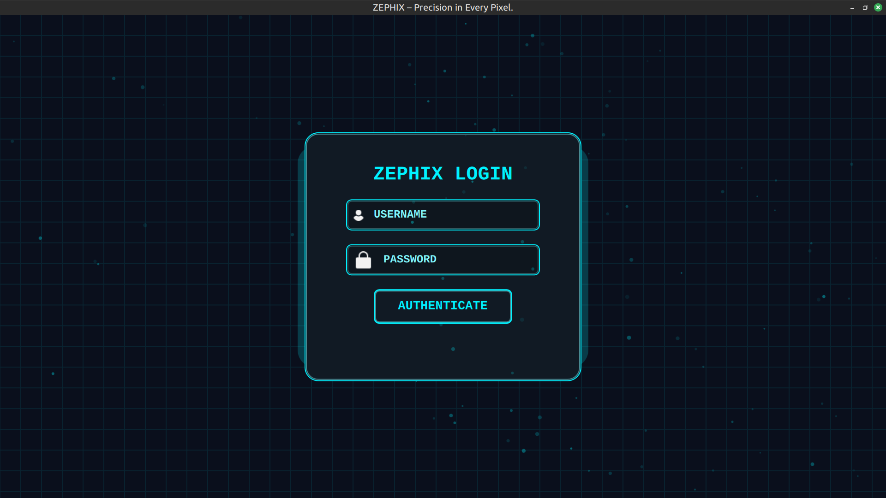
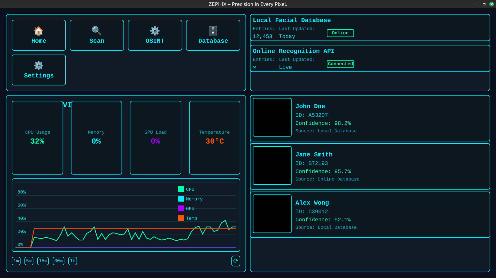
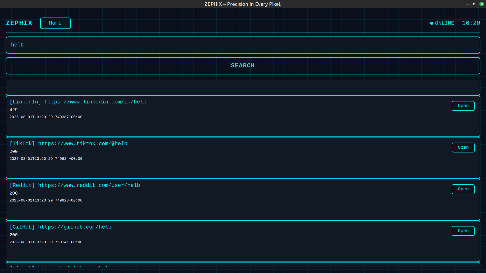

# FACEINTEL Recognition System


## Overview

**FACEINTEL** is an advanced, modular facial recognition and OSINT intelligence platform. Built with C++, QML, Python, and integrated with local and online databases, it enables real-time face matching, identity lookup, and forensic intelligence analysis.

##  Key Features

* 🔍 **Face Recognition Engine (SFace)**

  * Real-time matching from camera/image uploads
  * Confidence score visualization
  * Local database + cloud matching integration

*  **OSINT Lookup**

  * Email, phone, or username trace
  * Python-powered data scraping and enrichment
  * Seamless UI integration with live result viewing

*  **Futuristic Dashboard**

  * Neon grid visuals, holographic UI
  * CPU/GPU/memory activity monitor
  * Modular panels for matches, alerts, filters, analytics

*  **Authentication System**

  * Login page with credential verification
  * Secure session handling (QML & C++)

*  **Responsive Design**

  * Desktop-first UI with adaptive layout support
  * Grid-based visuals and animated interactions

##  Project Structure

```
FaceIntelSystem/
├── assets/              # Icons, system logos, placeholder images
├── qml/                 # QML interface files
│   ├── Dashboard.qml
│   ├── FaceScan.qml
│   ├── OSINTLookup.qml
│   ├── LoginPage.qml
├── OSINT/               # Python runner integration and C++ manager
│   ├── OsintManager.cpp/.h
│   └── Python/osint_runner/
├── Auth/                # Authentication logic (C++/QML bindings)
├── include/             # C++ headers
├── src/                 # Face recognition logic (SFace + OpenCV)
├── db/                  # MySQL/SQLite scripts
├── main.cpp
├── Main.qml
├── CMakeLists.txt
└── README.md
```

##  System Requirements

* **Qt 5.15+ or Qt 6+** with QtQuick, Controls 2, and QML modules
* **OpenCV 4.5+** with DNN module
* **Python 3.9+** with required packages for OSINT
* **CMake 3.16+**
* **MySQL/SQLite** for local data persistence

##  Build & Run

```bash
git clone https://github.com/joseph-tech-dev/faceRecognition.git
cd FaceIntelSystem
mkdir build && cd build
cmake ..
make
./FaceIntelSystem
```

Or use `qmlscene` for UI development:

```bash
qmlscene qml/Main.qml
```

##  UI Preview

>  Place screenshots in the `assets/` directory and update the links accordingly.

| Page             | Screenshot                    |
| ---------------- | ------------------------------|
| **Login Page**   |          |
| **Dashboard**    |      |
| **OSINT Lookup** |          |
| **Database**     |  |
##  Navigation

* **LoginPage.qml** → Secure access
* **Dashboard.qml** → Main control hub
* **FaceScan.qml** → Upload & detect
* **OSINTLookup.qml** → Identity tracing

##  Theme Customization

Change colors in `Main.qml` or theme constants:

```qml
property color neonBlue: "#00f2ff"
property color bgColor:  "#0a0f1c"
property color panelColor: "#111a24"
```

##  Data Sources

* **Local Database (MySQL/SQLite)**: Face vectors, users, match history
* **Online APIs**: PimEye, Sherlock-style traces, metadata fetchers
* **Filesystem**: Drag-and-drop uploads, logs, and snapshots

##  Troubleshooting

| Issue                    | Solution                                    |
| ------------------------ | ------------------------------------------- |
| Blank UI panels          | Check QML module paths and bindings         |
| Python errors in OSINT   | Validate script path, fix relative imports  |
| Unresponsive Open button | Ensure valid `url` field in OSINT data      |
| Build fails on Linux     | Run `chmod +x` on shell scripts / `main.py` |

##  License

Licensed under the **MIT License** — see `LICENSE` file for details.

##  Contributing

Pull requests are welcome. Submit issues or feature requests on GitHub.
If you're contributing code, ensure your patches match the coding style and pass linting.

---

##  Contact

For inquiries or support: [predatormj.v3@gmail.com](mailto:predatormj.v3@gmail.com)

---

> © 2025 FACEINTEL SYSTEM | Built with ❤️ in Qt, C++, Python, and AI
